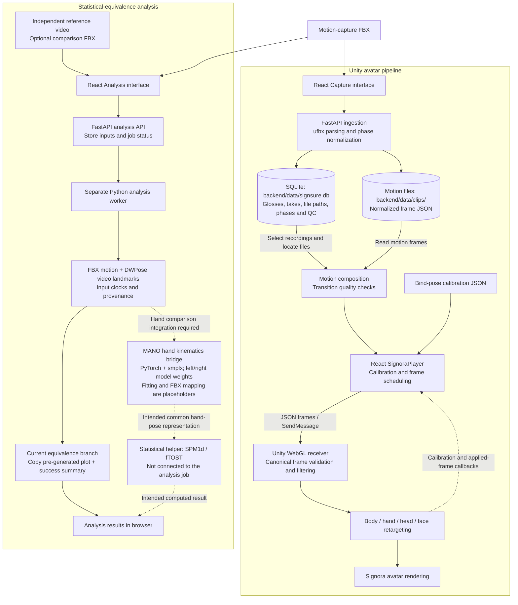

# SignSure architecture: statistical equivalence and Unity

Scope: statistical-equivalence analysis and Unity avatar playback only. Based on the working tree inspected on 8 October 2026.

Solid arrows show current execution paths. Dashed arrows in the statistical section show integration still required; the dashed Unity arrow is an implemented browser callback.

## Unity pipeline

The Capture API accepts combined Rokoko FBX recordings with sign-phase boundaries. The backend extracts body landmarks, 21 points per hand and 52 ARKit facial-expression channels, stores normalized motion, and composes quality-gated tracks. React schedules canonical frames and sends them to Unity using `SendMessage`.

Unity validates and filters frames, then applies calibrated body, hand, head and face retargeters to the existing Signora avatar. The uploaded FBX character supplies motion. Playback waits for a successful calibration result. Unity build assets are served through `frontend/public/unity`, linked to `SignoraAvatarTracking/WebBuild`.

### Where SQLite is used

`backend/app/core/config.py` defaults `database_url` to `sqlite:///.../backend/data/signsure.db`. `backend/app/core/db.py` creates the SQLAlchemy engine and sessions, and application startup initializes the tables.

The `glosses` table stores vocabulary. `sign_clips` stores each take's canonical flag, source and motion file paths, content hash, FPS, duration, and phase/QC metadata. `ingest_jobs` tracks recording import status. Ingestion writes these rows; the sign and translation APIs query them to select recordings. Actual motion frames are stored separately as JSON files in `backend/data/clips/`, and composition loads the files referenced by the selected rows.

## Statistical-equivalence pipeline and current limitation

The Analysis API saves FBX/video inputs and job options locally. A background coordinator starts a separate Python worker, which extracts FBX motion and DWPose video landmarks and constructs an analysis manifest.

When `tolerance_profile` is `statistical_equivalence`, the current worker copies an existing `ftost_result.png` from a hard-coded local path and writes a success summary. Its statistical case-study call is commented out. This result is not computed from the uploaded recordings.

`backend/app/validation/statistics.py` contains an SPM1d-based functional TOST helper and Bland–Altman calculations, but these are not wired into that worker branch. `run_ftost_test.py` generates the plot using simulated waveforms. Neither the plot nor the current success summary establishes statistical equivalence for uploaded data. Statistical correctness and real-data integration require separate verification.

### MANO's current role

`MANOKinematicsBridge` in `backend/app/validation/kinematics.py` loads left and right MANO models from `backend/data/mano/` through `smplx` and implements forward kinematics to return hand joints and vertices. Its intended role is to represent reference-video and FBX hands in a common hand-pose space for comparison.

The video-landmark fitting and FBX-to-MANO mapping methods currently return zero pose arrays. No call to this bridge was found in the analysis worker or Unity playback path. It is therefore shown as a component awaiting integration, rather than an active analysis or rendering stage. Unity currently uses its own landmark-based `HandRetargeter`.

These are separate pipelines: the analysis worker reads uploaded FBX recordings and reference video, rather than capturing the rendered Unity output.

## Source map

| Component | Source |
|---|---|
| Capture normalization | `backend/app/services/ingest_service.py`, `backend/app/ingest/fbx.py` |
| Motion composition | `backend/app/services/compose_service.py`, `backend/app/ingest/compose.py` |
| SQLite configuration and models | `backend/app/core/config.py`, `backend/app/core/db.py`, `backend/app/models/__init__.py` |
| Browser Unity host and player | `frontend/src/components/SignoraStage.jsx`, `frontend/src/unity/SignoraPlayer.js` |
| Unity receiver and retargeting | `SignoraAvatarTracking/Assets/Signora/Runtime/WebGL/WebGLTrackingReceiver.cs`, `SignoraAvatarTracking/Assets/Signora/Runtime/Retargeting/SignoraAvatarDriver.cs` |
| Analysis upload and coordination | `backend/app/api/v1/analysis.py`, `backend/app/services/analysis_service.py` |
| Analysis execution | `backend/app/services/analysis_worker.py`, `backend/app/validation/video_pose.py` |
| Statistical helpers and demonstration | `backend/app/validation/statistics.py`, `run_ftost_test.py` |
| MANO bridge and model-loading check | `backend/app/validation/kinematics.py`, `test_mano.py` |

Only this documentation was updated; application code was unchanged.
